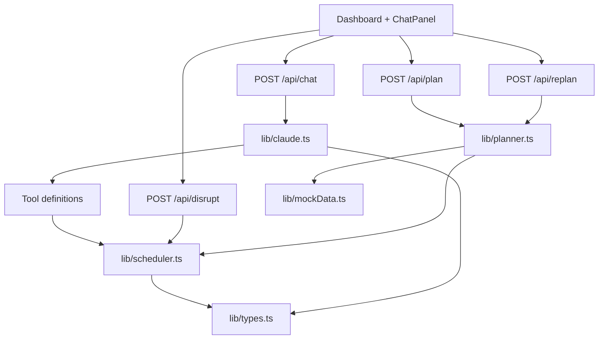

# TravelPilot

TravelPilot is an AI-powered trip planning and disruption-management agent for a hackathon demo. It builds a day-by-day itinerary, reasons about time and location, tracks estimated spend, and rebuilds the affected part of a trip when plans change.

## Problem Framing

Most travel products are good at individual searches and bookings, but they treat an itinerary as a collection of disconnected reservations. When a venue closes, a flight is delayed, weather changes, or a booking disappears, the traveler still has to manually work out which activities conflict, what is nearby, how much time remains, and whether the revised plan still fits the budget.

TravelPilot treats the itinerary as a connected plan. A change to one item can trigger deterministic conflict checks, backup selection, reordering, and budget recalculation. Claude provides the natural-language interface and chooses the right operation; TypeScript functions make the operational decisions quickly and repeatably.

## Architecture



### LLM orchestrator

- `src/lib/claude.ts` creates the Anthropic client from `ANTHROPIC_API_KEY`.
- Claude receives the trip JSON and the traveler question.
- Tool calls are dispatched to deterministic scheduler functions.
- `runAgentTurn` returns the final answer and an auditable list of tool names and arguments. The UI displays that tool trace as operational reasoning, not hidden chain-of-thought.

### Deterministic scheduler

- `src/lib/scheduler.ts` owns haversine clustering, time-aware ordering, conflict detection, backup selection, rebuilding, and budget calculations.
- `src/lib/planner.ts` creates repeatable demo itineraries from the static Paris catalog.
- `src/lib/types.ts` is the shared Zod and TypeScript contract for trips, days, items, preferences, and backups.
- `src/lib/mockData.ts` keeps the live demo independent of external place and transport APIs.

## Setup

### Prerequisites

- Node.js 20 or newer
- An Anthropic API key for chat functionality

### Install dependencies

This repository contains the application source but does not currently include generated Next.js project metadata. In a Next.js App Router project, install the runtime dependencies:

```bash
npm install next react react-dom zod @anthropic-ai/sdk
npm install -D typescript @types/node @types/react @types/react-dom tailwindcss postcss autoprefixer
```

Add these scripts to `package.json` if they are not already present:

```json
{
  "scripts": {
    "dev": "next dev",
    "build": "next build",
    "start": "next start",
    "lint": "next lint"
  }
}
```

Configure Tailwind to scan `src/app/**/*.{ts,tsx}`, `src/components/**/*.{ts,tsx}`, and `src/lib/**/*.{ts,tsx}`. Add a global stylesheet that imports Tailwind's base, components, and utilities layers.

Create `.env.local`:

```bash
ANTHROPIC_API_KEY=your_key_here
# Optional; the code defaults to claude-3-5-sonnet-latest
ANTHROPIC_MODEL=claude-3-5-sonnet-latest
```

Run the app:

```bash
npm run dev
```

Open `http://localhost:3000`. The initial dashboard uses static Paris demo data. Chat requests require a valid Anthropic key; itinerary planning, replanning, disruption simulation, and deterministic budget logic do not require live travel APIs.

## Demo Flow

1. Load the dashboard and let the initial trip generate.
2. Use the day tabs to inspect the timeline and budget sidebar.
3. Open **Edit trip**, change duration, budget, or interests, and apply the new constraints.
4. On an activity card, choose **Simulate disruption**, then select a reason such as `venue closed`.
5. Show the cancelled item, replacement, rebuilt day, updated budget, and amber disruption banner.
6. Ask ChatPanel one of its sample questions and expand the tool trace to show which deterministic operation Claude called.

## Problem Statement Mapping

| Problem-statement requirement | TravelPilot feature |
|---|---|
| Accept destination, dates, budget, interests, and preferences | Dashboard planning form and `POST /api/plan` request validation |
| Build a day-by-day itinerary | `lib/planner.ts` creates `Trip.days` with scheduled `TripItem` records |
| Coordinate activities by location, opening hours, travel time, and schedule | `mockData.ts` opening hours and locations plus scheduler ordering |
| Reduce unnecessary travel | `clusterByLocation` groups nearby items; `orderByHoursAndTravelTime` prioritizes feasible local sequences |
| Track transportation, accommodation, and activities together | `TripItem.type` supports all three categories and the dashboard renders them in one timeline |
| Estimate daily and total trip budget | `calculateBudget` and `BudgetSummary` |
| Modify budget, duration, or interests | Dashboard **Edit trip** panel and `POST /api/replan` |
| Rebuild when a booking or activity changes | `POST /api/disrupt` calls `rebuildDay` and returns an updated trip |
| Detect scheduling conflicts | `detectConflicts` reports overlaps and insufficient travel-time gaps; Claude exposes it as `check_conflicts` |
| Suggest alternatives when unavailable | `findAlternatives`, backups in `Trip.backups`, and the `find_alternatives` Claude tool |
| Answer natural-language itinerary questions | `ChatPanel`, `POST /api/chat`, and Claude tool calling in `lib/claude.ts` |
| Produce a final trip dashboard | `Dashboard`, `DayView`, `BudgetSummary`, `ChatPanel`, and disruption feedback banner |

## API Summary

### `POST /api/plan`

Accepts planning constraints and returns a validated `Trip` generated from the static demo catalog.

### `POST /api/chat`

Accepts `{ tripState, userMessage }` and returns `{ answer, toolLog }`.

### `POST /api/disrupt`

Accepts `{ tripState, itemId, reason }` and returns `{ trip, summary }` after rebuilding the affected day.

### `POST /api/replan`

Accepts `{ tripState, budget, durationDays, interests }` and returns `{ trip, summary }`. Existing items with `status: "confirmed"` are treated as locked and preserved when their dates remain in the new duration.

## Vercel Deployment

TravelPilot is configured for Vercel's native Next.js deployment. No custom
`vercel.json` is required.

1. Push the project to GitHub and import the repository in Vercel.
2. Keep the framework preset as **Next.js** and use the repository root.
3. Add these Production environment variables in Vercel:

```env
ANTHROPIC_API_KEY=your_real_anthropic_key
GOOGLE_PLACES_API_KEY=
ANTHROPIC_MODEL=claude-3-5-sonnet-latest
```

4. Deploy. Vercel will run the Next.js build and expose the App Router API routes automatically.

For CLI deployment after installing and authenticating with Vercel:

```bash
npx vercel
npx vercel --prod
```

The committed `.env.example` documents the required variables. Never commit
`.env.local` or real API keys. The current demo uses static India data, so
`GOOGLE_PLACES_API_KEY` is optional until live Places integration is enabled.
